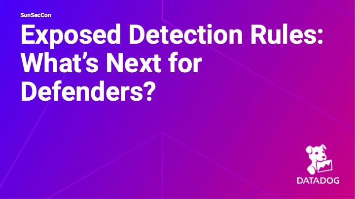

# SunSecCon 2025 - Exposed Detection Rules: What's next for defenders?

## Resources
- [Slides](sunseccon_exposed_detection_rules.pdf)
- [Recording](https://youtu.be/lVthQ2l896Y)
- [Website](https://www.socallinuxexpo.org/scale/22x/presentations/exposed-detection-rules-what%E2%80%99s-next-defenders)

## Repositories Discussed
- [GuardDog](https://github.com/DataDog/guarddog)
- [Supply Chain Firewall](https://github.com/DataDog/supply-chain-firewall)
- [Malicious Software Packages Dataset](https://github.com/DataDog/malicious-software-packages-dataset)

## Abstract
Open source security tools make security accessible. While their benefits are well known, they present a unique challenge: attackers have the same access to detection rules as defenders and contributors. This transparency can provide attackers with a roadmap to bypass defenses. How can open source contributors continue to maintain and evolve these tools while effectively countering attackers?

This session explores the dynamic relationship between open source security tools and adversarial tactics. We’ll dive into strategies that empower open source contributors to stay ahead, such as leveraging community-driven intelligence and fostering collaborative ecosystems for rapid response to emerging threats. Attendees will learn practical approaches to balancing transparency with resilience, ensuring open source tools remain robust and effective despite the inherent visibility of their detection mechanisms. Whether you’re a contributor, maintainer, or user, this talk will offer insights into fortifying the open source security landscape against evolving attacker methodologies.
